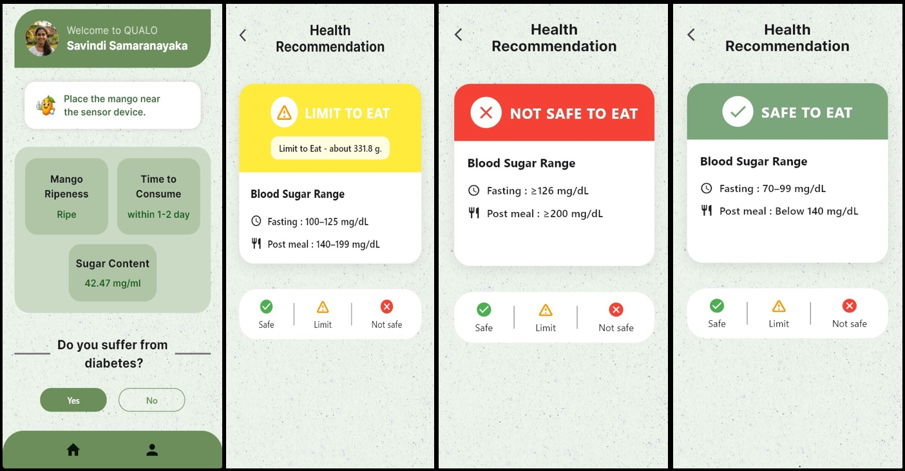

# 🥭 QualityQuest

## AI-Based IoT System for Non-Destructive Ripeness Detection in Brown-Bagged TomEJC Mangoes

QualityQuest is an AI-powered IoT system designed to assess the internal quality of brown-bagged TomEJC mangoes without causing physical damage to the fruit.

The system combines multiple sensors, machine learning models, cloud connectivity, and a Flutter mobile application to provide real-time ripeness detection, sugar content estimation, time-to-consume prediction, and personalized health recommendations.

---

## 📖 Problem Statement

Brown-bagged TomEJC mangoes develop a yellow peel regardless of their actual ripeness stage. As a result, traditional visual inspection methods become unreliable.

Consumers often need to:

- Cut the fruit
- Press the fruit manually
- Guess the ripeness

These methods are inaccurate and can lead to fruit wastage and poor purchasing decisions.

QualityQuest provides a non-destructive alternative using IoT sensors and machine learning.

---

## 🎯 Project Objectives

- Develop a non-destructive IoT-based mango quality assessment system.
- Measure internal quality parameters using multiple sensors.
- Classify mango ripeness using machine learning.
- Predict optimal consumption time.
- Provide health-aware recommendations for diabetic users.
- Deliver results through a user-friendly mobile application.

---

# 🚀 Key Features

### Mango Ripeness Detection

Classifies mangoes as:

- Raw
- Ripe

using multi-sensor data and machine learning.

---

### Sugar Content Estimation

Measures internal sugar content (Brix value) without cutting the fruit.

---

### Time-to-Consume Prediction

Predicts when the mango should be consumed for optimal quality.

---

### Health Recommendation Engine

Provides personalized recommendations based on:

- Sugar Content
- Mango Weight
- User Diabetes Status

Recommendations include:

- Safe
- Limit Consumption
- Not Recommended

---

# 🏗 System Work Flow

---

  

# 🔬 Hardware Components

| Component | Purpose |
|------------|----------|
| ESP32 | Main controller |
| AS7263 NIR Sensor | Sugar content & acidity estimation |
| BME688 | Aroma/VOC detection |
| MPU6050 | Firmness estimation |
| Load Cell + HX711 | Weight measurement |
| Servo Motor | Controlled tapping mechanism |

---

# 🤖 Machine Learning Pipeline

### Data Collection

Sensor readings:

- Sugar Content
- Acidity
- Aroma
- Firmness
- Weight

### Data Processing

- Noise Reduction
- Normalization
- Feature Extraction
- Multi-Sensor Data Fusion

### Model Training

Evaluated models:

- Random Forest
- Support Vector Machine (SVM)
- Artificial Neural Network (ANN)

Validation Techniques:

- K-Fold Cross Validation
- Grid Search Hyperparameter Optimization

Performance Metrics:

- Accuracy
- Precision
- Recall
- F1 Score
- ROC-AUC

---

# 📱 Mobile Application

Built using Flutter.

---

# 🛠 Technologies Used

### Mobile Application
- Flutter
- Dart

### Backend
- Python
- REST API

### Machine Learning
- Scikit-learn
- TensorFlow
- Pandas
- NumPy

### Database
- MySQL

### Cloud & Deployment
- AWS

### Hardware & IoT

- ESP32
- Arduino IDE
- AS7263
- BME688
- MPU6050 with Servo Motor
- HX711 + Load cell

### Development Tools

- VS Code
- Postman
- Figma
- Draw.io
- GitHub

---

# 📄 License

This repository is maintained for academic and research purposes.

© 2026 QualityQuest Team
